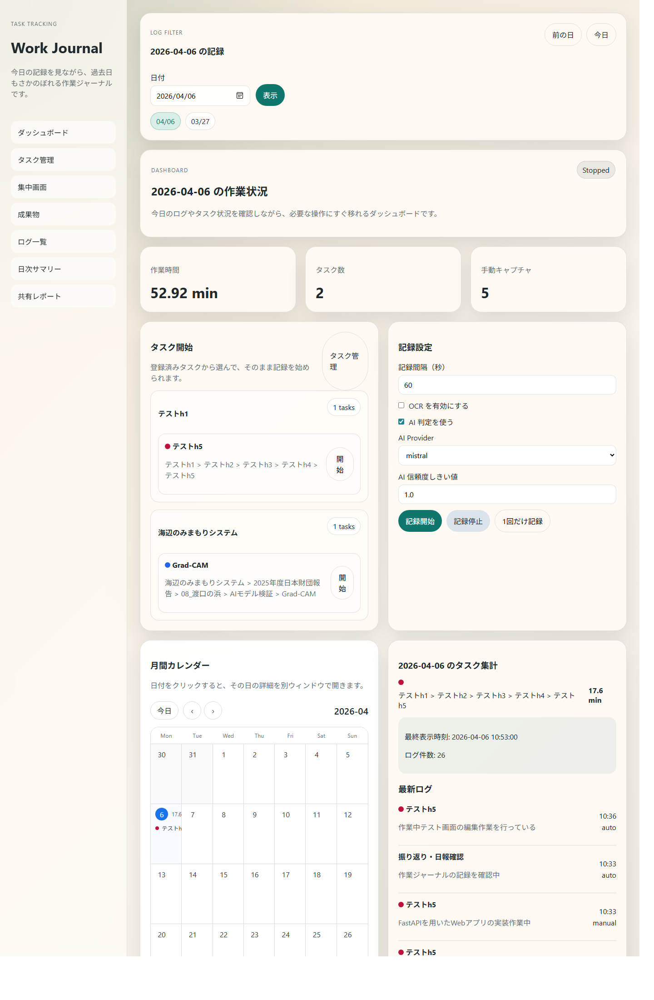
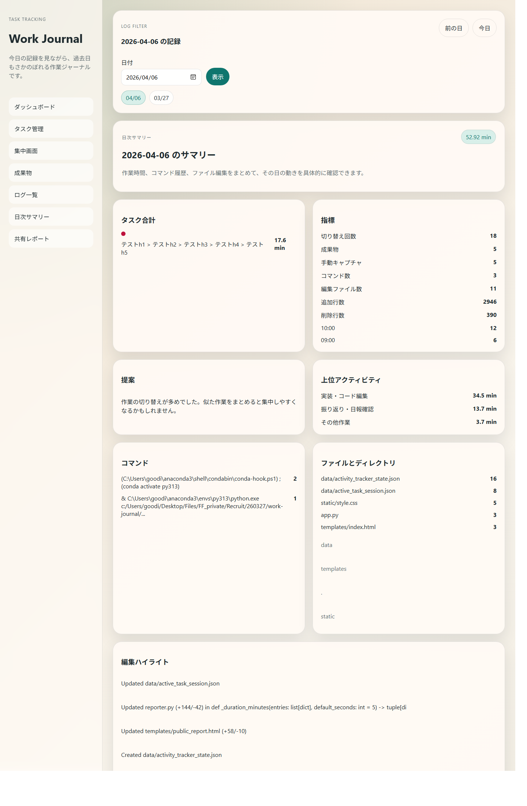
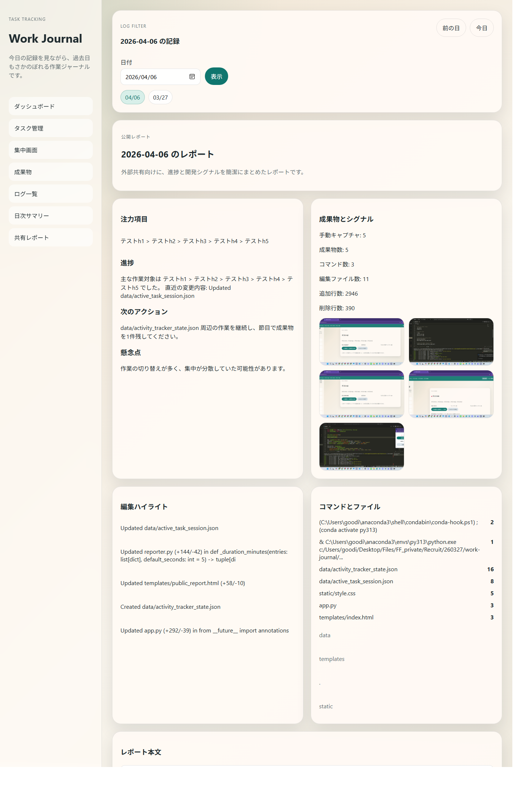
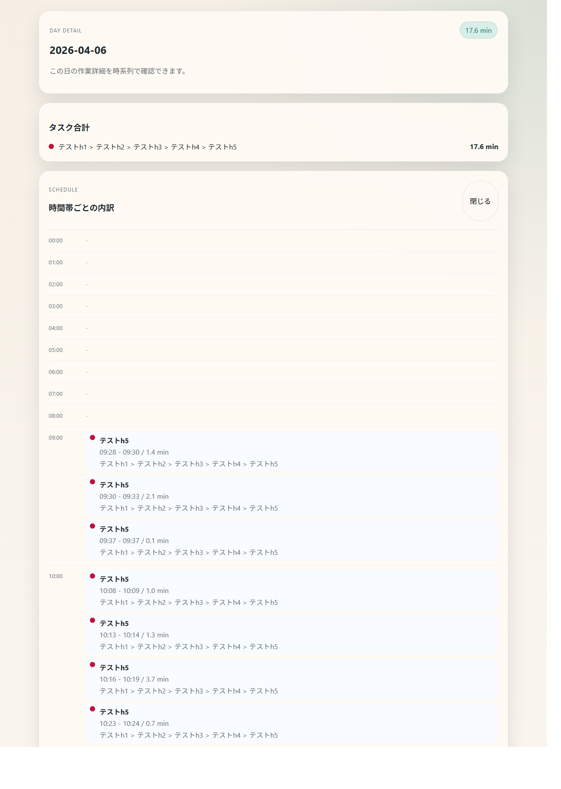

# Work Journal

ローカル PC 上の作業を、スクリーンショットとタスク単位で記録・要約する FastAPI 製の Web アプリです。  
「今どのタスクに時間を使っていたか」「どんな画面を見ていたか」「その日の進捗をどう共有するか」を、軽量なローカル保存で追えるようにしています。

## 概要

このアプリでできること:

- タスクを階層付きで登録し、作業開始・停止を記録する
- 作業中の画面を定期または手動でキャプチャする
- アクティブウィンドウ名、OCR、AI 判定を使って作業内容を要約する
- 日次サマリー、公開レポート、成果物一覧を画面で確認する
- 月間カレンダーから、日単位の詳細を別ウィンドウで確認する
- ログやタスク情報を JSON / JSONL でローカル保存する

## スクリーンショット

### ダッシュボード



### 日次サマリー



### 公開レポート



### 日別詳細ポップアップ



スクリーンショット元ファイル:

- `docs/screenshots/dashboard.png`
- `docs/screenshots/private-summary.png`
- `docs/screenshots/public-report.png`
- `docs/screenshots/calendar-day.png`

## 主な機能

### 1. タスク管理

- `h1` から `h5` までの階層でタスクを定義
- タスクごとに色を設定
- タスク開始時にアクティブセッションを持ち、停止時にセッションログへ保存

### 2. スクリーンショット記録

- `mss` を使って画面をキャプチャ
- 定期記録と手動記録の両方に対応
- 手動キャプチャはアクティブタスクの成果物として紐付け

### 3. 作業内容の分類

- アクティブウィンドウ名からルールベースで活動を推定
- OCR を有効化すると、画像から文字を抽出して分類精度を補強
- ルールベースの信頼度が低い場合のみ、任意で AI 判定へフォールバック

### 4. レポート画面

- ダッシュボード
- タスク管理
- タイムライン
- 日次サマリー
- 公開レポート
- 成果物一覧
- フォーカスモード
- ミニコントロール

### 5. ローカル保存

- スクリーンショット: `data/screenshots/YYYY-MM-DD/`
- アクティビティログ: `data/logs/activity_log.jsonl`
- タスクセッションログ: `data/logs/task_sessions.jsonl`
- タスク定義: `data/tasks.json`
- アクティブセッション: `data/active_task_session.json`

## 技術スタック

- Python
- FastAPI
- Jinja2
- Uvicorn
- Pillow
- mss
- pytesseract
- python-dotenv

## ディレクトリ構成

```text
work-journal/
  ai_clients/                AI クライアント実装
  data/                      ローカル保存データ
  docs/screenshots/          README 用スクリーンショット
  prompts/                   AI 判定用プロンプト
  static/                    CSS など静的ファイル
  templates/                 Jinja2 テンプレート
  activity_context.py        コマンド、編集ファイルなどの収集
  analyzer.py                OCR / ルールベース / AI 判定
  app.py                     FastAPI エントリポイント
  recorder.py                スクリーンショット記録サービス
  reporter.py                日次サマリー / 公開レポート生成
  sample_data.py             初回起動用サンプルデータ生成
  storage.py                 保存先と JSON / JSONL 操作
  task_manager.py            タスク管理とセッション管理
  requirements.txt
  README.md
```

## セットアップ

### 前提

- Windows 環境を想定
- Python 3.11 系の実行環境（例: Conda `py311`）
- OCR を使う場合は Tesseract OCR の別途インストールが必要

### 1. 依存関係を入れる

```powershell
python -m pip install -r requirements.txt
```

Conda `py311` を使う場合は、`python` の向き違いを避けるため次のコマンドが確実です。

```powershell
C:\Users\<username>\anaconda3\envs\py311\python.exe -m pip install -r requirements.txt
```

### 2. 環境変数を用意する

```powershell
Copy-Item .env.example .env
```

主な設定項目:

- `CAPTURE_INTERVAL_SECONDS`
  - 自動キャプチャ間隔（秒）
- `AI_ENABLED`
  - `true` で AI 判定を有効化
- `AI_PROVIDER`
  - `mock` / `mistral` / `openai`
- `AI_CONFIDENCE_THRESHOLD`
  - ルールベース判定から AI にフォールバックする閾値
- `MISTRAL_API_KEY`
  - Mistral 利用時に必要
- `MISTRAL_VISION_MODEL`
  - Mistral の画像系モデル名
- `OPENAI_API_KEY`
  - OpenAI 利用時に必要

### 3. 起動する

通常起動:

```powershell
python app.py
```

Conda `py311` 前提の起動:

```powershell
.\run_py311.ps1
```

起動後は次を開きます。

```text
http://127.0.0.1:8000
```

## 使い方

### 基本フロー

1. `/tasks` でタスクを登録する
2. ダッシュボードまたはタスク一覧からタスクを開始する
3. 必要に応じて記録設定で OCR / AI を切り替える
4. 作業中は自動または手動でスクリーンショットを残す
5. `/private-summary` や `/public-report` で1日の内容を確認する

### 月間カレンダー

- ダッシュボードの月間カレンダーから日付ごとの作業量を確認できます
- 日付クリックで、その日の詳細を別ウィンドウで開きます

### 成果物確認

- `/artifacts` では、手動キャプチャだけをタスク単位で確認できます
- 節目で手動キャプチャを残すと、進捗共有に使いやすくなります

## サンプルデータ

初回起動時、`data/logs/sample_activity_log.jsonl` が存在しなければサンプルデータを自動生成します。  
手動生成したい場合は次でも実行できます。

```powershell
python sample_data.py
```

## AI / OCR の挙動

### OCR

- `enable_ocr` を有効にすると `pytesseract` を使って画像から文字を抽出します
- OCR が使えない場合でも、アプリ自体はルールベース判定で動作します

### AI 判定

- まずルールベース判定を実施
- 信頼度が `AI_CONFIDENCE_THRESHOLD` 未満のときだけ AI を呼びます
- 現在の実装は `mock` / `mistral` / `openai` に対応しています

## 保存ファイル

主な出力先:

- `data/screenshots/`
- `data/logs/activity_log.jsonl`
- `data/logs/task_sessions.jsonl`
- `data/logs/sample_activity_log.jsonl`
- `data/tasks.json`
- `data/active_task_session.json`

## 制約と補足

- ローカル PC 向けのモック / 検証アプリです
- DB は使わず、ファイルベースで保存しています
- OCR 精度は Tesseract の導入状況や画面内容に依存します
- AI 判定を有効にした場合、外部 API の応答時間や料金の影響を受けます
- スクリーンショットには機密情報が含まれる可能性があるため、保存先の扱いには注意が必要です

## 今後の改善候補

- 文字化けが残っているテンプレートの整理
- SQLite などへの保存先拡張
- フィルタや検索の強化
- 公開レポートのテンプレート改善
- AI 判定のプロンプト改善とマスキング強化
